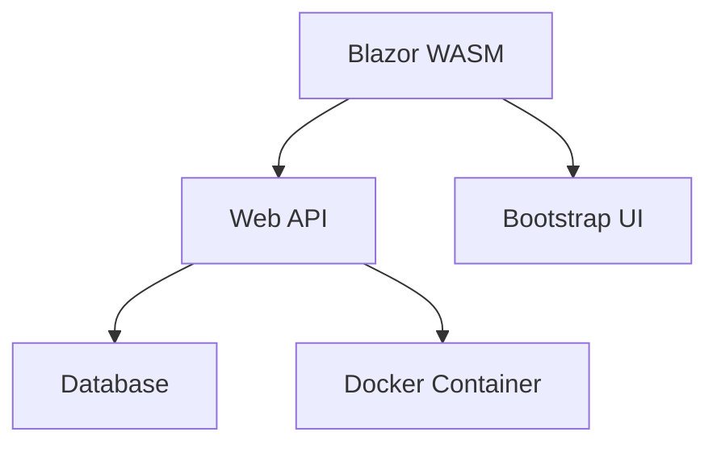

# 🎯 H2 Projekt Dashboard

> [!INFO] Projekt Status
> **Start dato:** Januar 2024
> **Status:** 🟡 I gang
> **Team:** Backend + Frontend udvikling

## 📊 Quick Links
- [[Backend-API/C-Sharp Web API|🔧 API Dokumentation]]
- [[Frontend-Blazor/Blazor WASM|🎨 Frontend App]]
- [[🚀 Obsidian Funktioner Guide|📖 Obsidian Guide]]

## 🏗️ Arkitektur Oversigt

## ✅ Tasks Overview

### 🔴 Høj Prioritet
- [ ] Database integration setup
- [ ] Authentication implementation
- [ ] Error handling improvements

### 🟡 Medium Prioritet  
- [ ] Unit tests for API endpoints
- [ ] Frontend responsive design
- [ ] API documentation completion

### 🟢 Lav Prioritet
- [ ] Performance optimization
- [ ] Additional UI components
- [ ] Deployment automation

## 📈 Progress Tracking

| Component | Status | Completion |
|-----------|--------|------------|
| API Setup | ✅ Done | 100% |
| Basic Endpoints | ✅ Done | 100% |
| Frontend Structure | ✅ Done | 100% |
| Database Integration | 🟡 In Progress | 30% |
| Authentication | ❌ Not Started | 0% |
| Testing | 🟡 In Progress | 20% |

## 📝 Meeting Notes
- [[Templates/Møde Template|📋 Møde Template]] - Brug denne til meetings
- Last meeting: TBD
- Next meeting: TBD

## 🔗 Eksterne Resources
- [ASP.NET Core Docs](https://docs.microsoft.com/en-us/aspnet/core/)
- [Blazor Documentation](https://docs.microsoft.com/en-us/aspnet/core/blazor/)
- [Docker Documentation](https://docs.docker.com/)

---
**Tags:** #h2-projekt #dashboard #overview
**Sidst opdateret:** {{date}}